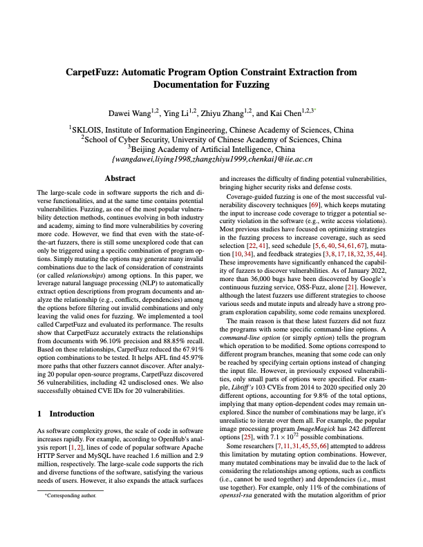

# CarpetFuzz #

<p><a href="http://kaichen.org/paper/conference/usenix2023_wang.pdf"></a></p>

CarpetFuzz is an NLP-based fuzzing assitance tool for generating valid option combinations.

The basic idea of CarpetFuzz is to use natural language processing (NLP) to identify and extract the relationships (e.g., conflicts or dependencies) among program options from the description of each option in the documentation and filter out invalid combinations to reduce the option combinations that need to be fuzzed.

For more details, please refer to [our paper](http://kaichen.org/paper/conference/usenix2023_wang.pdf) from USENIX Security'23.

The [CarpetFuzz-experiments](https://github.com/waugustus/CarpetFuzz-experiments) repository contains the data sets, scripts, and documentation required to reproduce our results in the paper.

## Structure ##

|Directory|Description|
|---|---|
|[dataset](dataset)|Training dataset to obtain the model|
|[fuzzer](https://github.com/waugustus/CarpetFuzz-fuzzer)|Modified fuzzer to switch combinations on the fly. (Submodule)|
|[images](images)|Images used in README.md| 
|[models](models)|Models used to extract relationships|
|[output](output)|CarpetFuzz's output files|
|[pict](https://github.com/microsoft/pict)|Microsoft's pairwise tool. (Submodule)|
|[scripts](scripts)|Python scripts to identify, extract relationships and rank combinations based on their dry-run coverage.|
|[scripts/utils](scripts/utils)|Some general purposed utility class.|
|[tests](tests)|Some sample files to test CarpetFuzz.|
|[tests/dict](tests/dict)|Sample dictionary file used to generate stub (involving 49 programs).|
|[tests/manpages](tests/manpages)|Sample manpage files.|

## Installation ##

```
# Download CarpetFuzz repo with the submodules
git clone --recursive https://github.com/waugustus/CarpetFuzz
cd CarpetFuzz

# Build CarpetFuzz-fuzzer (LLVM 11.0+ is recommended)
pushd fuzzer
make clean all
popd

# Build Microsoft pict
pushd pict
cmake -DCMAKE_BUILD_TYPE=Release -S . -B build
cmake --build build
pushd build && ctest -v && popd
popd

# Install required pip modules (virtualenv is recommended)
python3 -m venv venv
source venv/bin/activate
pip3 install -r requirements.txt
python3 -m spacy download en_core_web_sm-3.0.0 --direct

# Download AllenNLP's parser model
wget -P models/ https://allennlp.s3.amazonaws.com/models/elmo-constituency-parser-2020.02.10.tar.gz
```

## Usage ##

We take the program `tiffcp` as an example,

```
export CarpetFuzz=/path/to/CarpetFuzz

# Step 1
# Download and build the tiffcp repo with CarpetFuzz-fuzzer
git clone https://gitlab.com/libtiff/libtiff
cd libtiff
sh ./autogen.sh
CC=${CarpetFuzz}/fuzzer/afl-clang-fast CXX=${CarpetFuzz}/fuzzer/afl-clang-fast++ ./configure --prefix=$PWD/build_carpetfuzz --disable-shared
make -j;make install;make clean
# Prepare the seed
mkdir input
cp ${CarpetFuzz}/fuzzer/testcases/images/tiff/* input/

# Step 2
# Use CarpetFuzz to analyze the relationships from the manpage file
# The manpage files are usually in the build directory (share/man/man1).
python3 ${CarpetFuzz}/scripts/find_relationship.py --file $PWD/build_carpetfuzz/share/man/man1/tiffcp.1
# Based on the relationship, use pict to generate 6-wise combinations
python3 ${CarpetFuzz}/scripts/generate_combination.py --relation ${CarpetFuzz}/output/relation/relation_tiffcp.json
# Rank each combination with its dry-run coverage
python3 ${CarpetFuzz}/scripts/rank_combination.py --combination ${CarpetFuzz}/output/combination/combination_tiffcp.txt --dict ${CarpetFuzz}/tests/dict/dict.json --bindir $PWD/build_carpetfuzz/bin --seeddir input

# Step 3
# Fuzz with the ranked stubs
${CarpetFuzz}/fuzzer/afl-fuzz -i input/ -o output/ -K ${CarpetFuzz}/output/stubs/ranked_stubs_tiffcp.txt -- $PWD/build_carpetfuzz/bin/tiffcp @@
```

## CVEs found by CarpetFuzz ##

CarpetFuzz has found 56 crashes on our real-world dataset, of which 42 are 0-days. So far, 20 crashes have been assigned with CVE IDs.

|CVE|Program|Type|
|---|---|---|
|CVE-2022-0865|tiffcp|assertion failure|
|CVE-2022-0907|tiffcrop|segmentation violation|
|CVE-2022-0909|tiffcrop|floating point exception|
|CVE-2022-0924|tiffcp|heap buffer overflow|
|CVE-2022-1056|tiffcrop|heap buffer overflow|
|CVE-2022-1622|tiffcp|segmentation violation|
|CVE-2022-1623|tiffcp|segmentation violation|
|CVE-2022-2056|tiffcrop|floating point exception|
|CVE-2022-2057|tiffcrop|floating point exception|
|CVE-2022-2058|tiffcrop|floating point exception|
|CVE-2022-2953|tiffcrop|heap buffer overflow|
|CVE-2022-3597|tiffcrop|heap buffer overflow|
|CVE-2022-3598|tiffcrop|heap buffer overflow|
|CVE-2022-3599|tiffcrop|heap buffer overflow|
|CVE-2022-3626|tiffcrop|heap buffer overflow|
|CVE-2022-3627|tiffcrop|heap buffer overflow|
|CVE-2022-4450|openssl-asn1parse|double free|
|CVE-2022-4645|tiffcp|heap buffer overflow|
|CVE-2022-29977|img2sixel|assertion failure|
|CVE-2022-29978|img2sixel|floating point exception|
|CVE-2023-0795|tiffcrop|segmentation violation|
|CVE-2023-0796|tiffcrop|segmentation violation|
|CVE-2023-0797|tiffcrop|segmentation violation|
|CVE-2023-0798|tiffcrop|segmentation violation|
|CVE-2023-0799|tiffcrop|heap use after free|
|CVE-2023-0800|tiffcrop|heap buffer overflow|
|CVE-2023-0801|tiffcrop|heap buffer overflow|
|CVE-2023-0802|tiffcrop|heap buffer overflow|
|CVE-2023-0803|tiffcrop|heap buffer overflow|
|CVE-2023-0804|tiffcrop|heap buffer overflow|

## Credit ##

Thanks to Ying Li ([@Fr3ya](https://github.com/Fr3ya)) and Zhiyu Zhang ([@QGrain](https://github.com/QGrain)) for their valuable contributions to this project.

## Citing this paper ##

In case you would like to cite CarpetFuzz, you may use the following BibTex entry:

```
@inproceedings {
}
```
